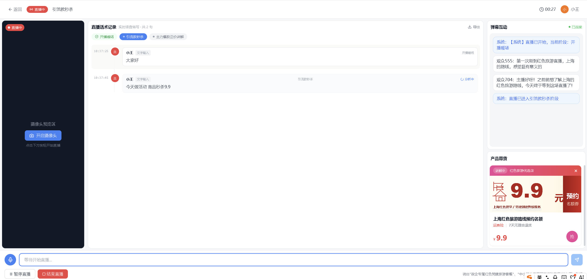
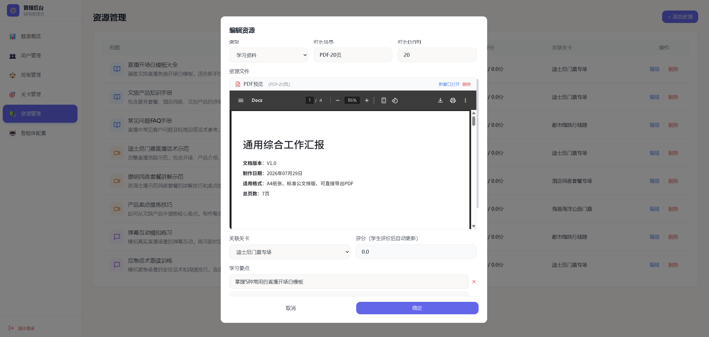
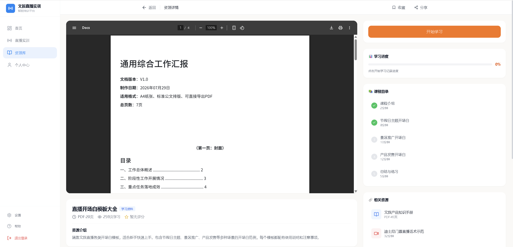
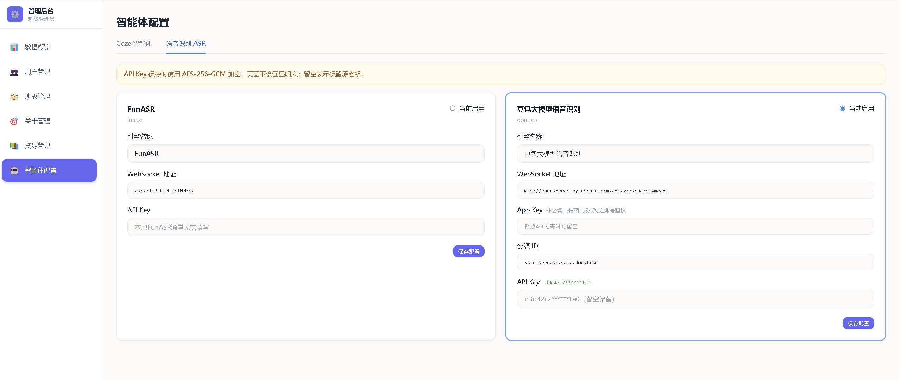
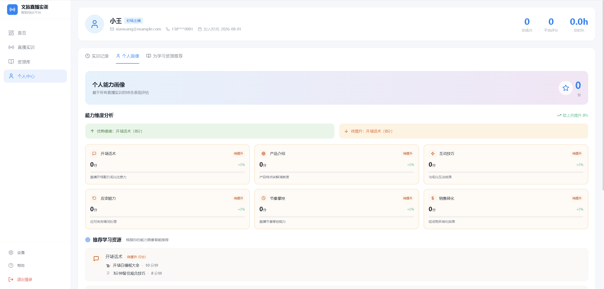
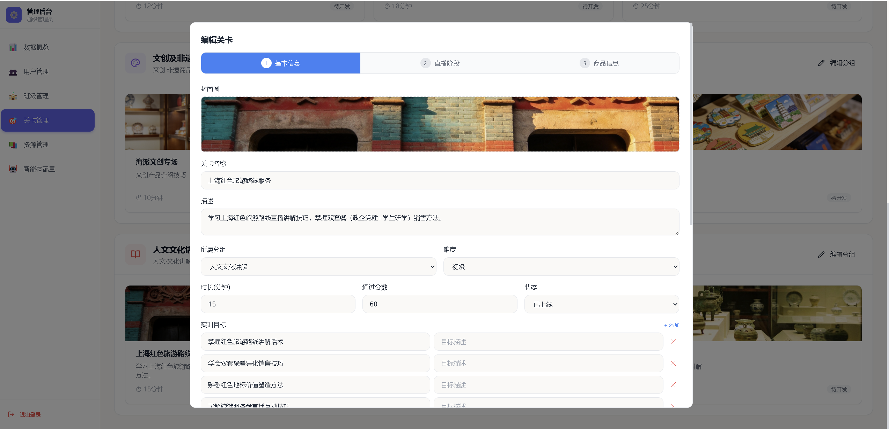

# AgentEdu

> 让 AI 成为企业培训和技能成长的新型导师

一个基于 AI Agent 的智能实训平台，
通过知识库、语音交互、数字人和能力评估，
打造沉浸式岗位训练体验。
一个面向职业培训、企业培训、技能考核场景的 AI 智能体实训平台。
通过 AI Agent + 知识库 + 语音交互 + 数字人，实现模拟真实业务场景的智能训练。

---

## ✨ 项目介绍

传统培训通常依赖：

- 教师授课
- 视频课程
- 文档学习
- 人工评价

存在：

- 互动不足
- 无法个性化指导
- 缺少真实场景模拟
- 培训效果难量化


AgentEdu 希望探索：

> 让 AI 成为每个人身边的专业导师。


通过构建不同领域的 AI 智能体：

- 销售训练智能体
- 导游讲解智能体
- 产品介绍智能体
- 企业岗位培训智能体

模拟真实工作环境，帮助用户完成学习、练习和能力提升。


---

# 🚀 核心能力


## 1. AI 实训智能体

每个训练场景拥有独立 Agent：

```
用户
 |
 | 对话 / 语音
 |
AI Agent
 |
 ├── 场景知识库
 ├── 技能规则
 ├── 评价模型
 └── 学习路径
```


支持：

- 角色设定
- 场景模拟
- 多轮对话
- 智能指导
- 自动评分


---

## 2. 知识资源管理


支持上传：

- PDF
- 文档
- 培训资料
- 产品手册
- SOP流程


形成 AI 可理解知识库。


功能：

- 资源管理
- 文档预览
- 关联训练课程
- 学习重点配置


---

## 3. 数字人交互


支持：

- 语音识别 ASR
- 大模型对话
- 语音合成 TTS
- 数字人口型驱动


实现：

```
用户讲话

 ↓

语音识别

 ↓

AI Agent理解

 ↓

生成回答

 ↓

数字人回复
```


---

## 4. 实训过程评估


根据用户表现生成：

- 能力画像
- 技能评分
- 优势分析
- 改进建议


例如：

```
销售能力

★★★★★

优势:
- 产品介绍清晰

不足:
- 缺少客户需求挖掘

推荐学习:
- 销售沟通技巧
```


---

# 📸 Demo


## 实训直播交互





## 资源管理







## AI能力配置





## 个人能力画像





## 关卡管理




---

# 🏗️ 技术架构


```
                用户

                 |
                 
        Web / Desktop Client

                 |

          AI Training Platform

                 |

        -----------------

        Agent Runtime

        Knowledge Base

        Skill System

        Evaluation Engine

        -----------------

                 |

        LLM / ASR / TTS

                 |

             Digital Human

```


---

# 技术栈

Frontend:

- Vue3
- TypeScript
- Ant Design Vue


Backend:

- Java / .NET / NODEJS
- REST API
- WebSocket


AI:

- LLM Agent
- RAG
- ASR
- TTS
- Digital Human


Storage:

- PostgreSQL
- Redis
- MinIO


---

# 应用场景


## 企业培训

员工岗位培训

新人入职训练


## 政企培训

窗口人员服务能力训练

业务知识培训


## 职业教育

技能模拟训练

AI老师辅助教学


## 企业销售

销售话术训练

产品介绍训练


---

# Roadmap


- [x] AI Agent 实训 Demo
- [x] 知识资源管理
- [x] 训练课程管理
- [x] 能力评价模型
- [x] 数字人交互
- [x] 多 Agent 协作
- [x] Skill 市场
- [x] 企业知识库接入
- [x] 私有化部署


---

# About

Created by AI application developer.

Exploring:
- AI Agent
- Digital Human
- Enterprise AI Application

## 👨‍💻 关于作者

一名专注 AI 应用开发的软件工程师。

目前探索方向：

- AI Agent
- RAG 知识库
- MCP 工具连接
- Skill 技能体系
- 数字人交互
- 企业智能应用

希望通过 AI 技术解决真实业务问题。
---

## 📮 联系方式

如果你对 AI 智能体、数字人应用、企业 AI 落地感兴趣，欢迎交流。

微信：
armys_ai

邮箱：
zhang1287@foxmail.com


关注方向：

- AI Agent 应用开发
- 数字人交互系统
- 企业智能体建设
- AI + 业务场景落地
